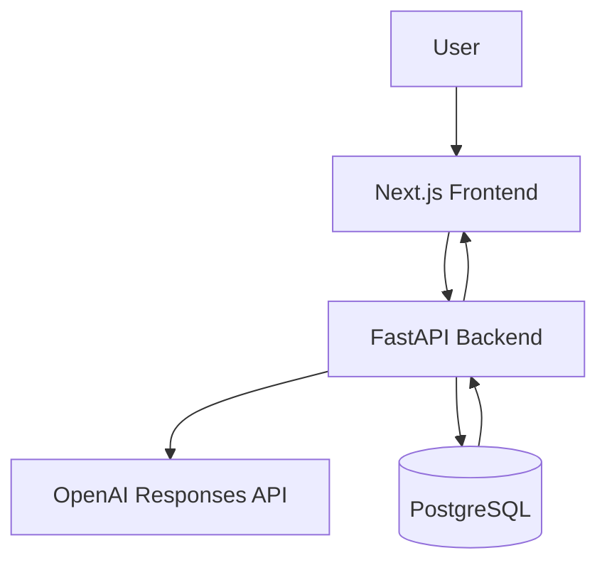
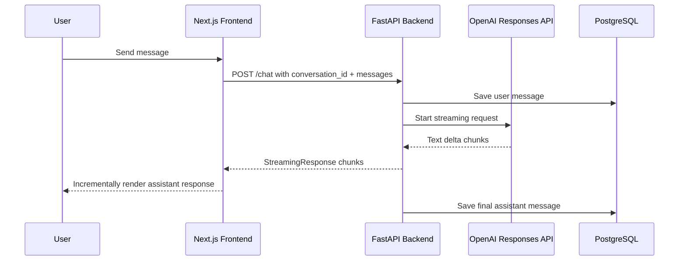
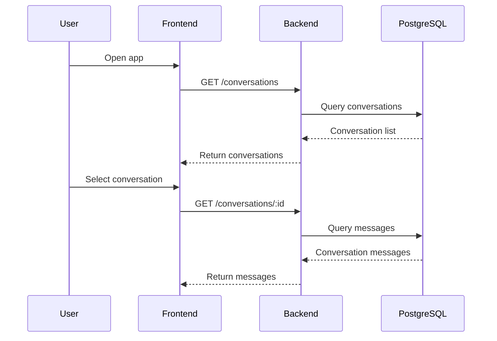
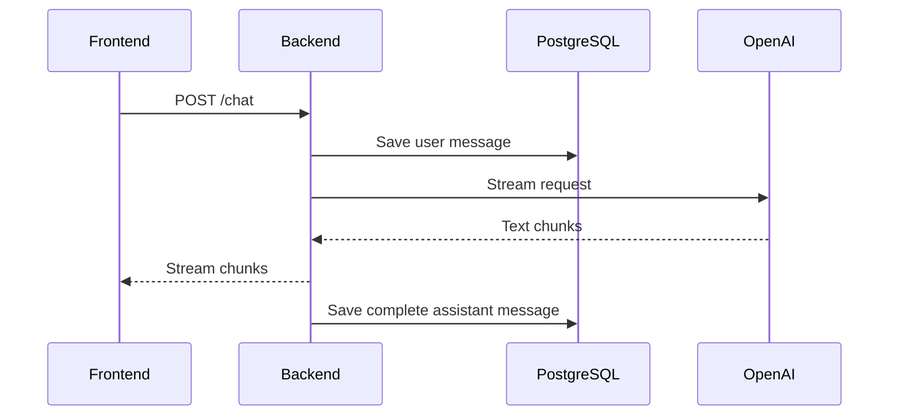
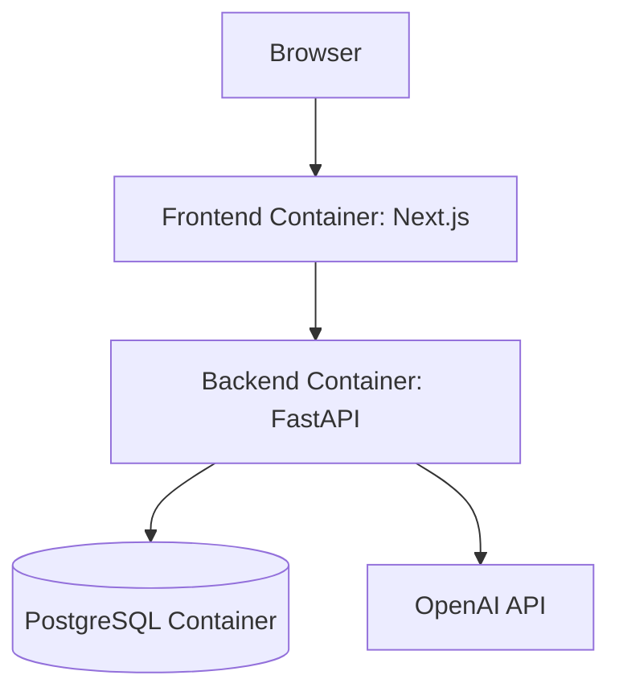
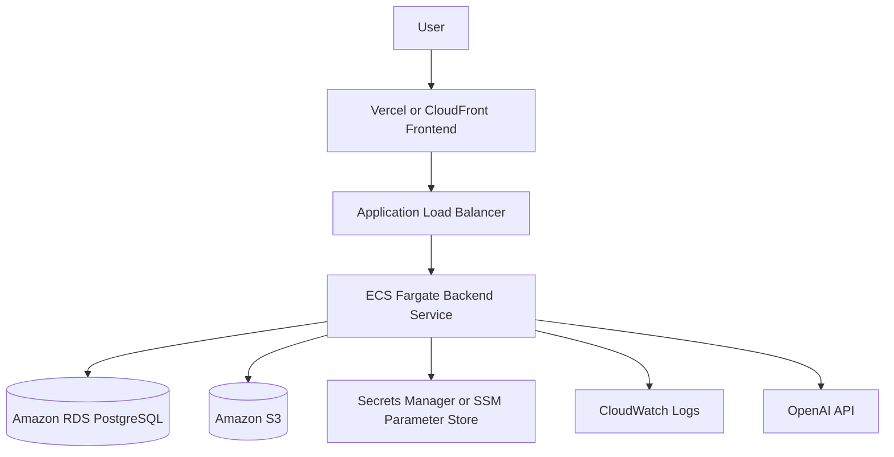
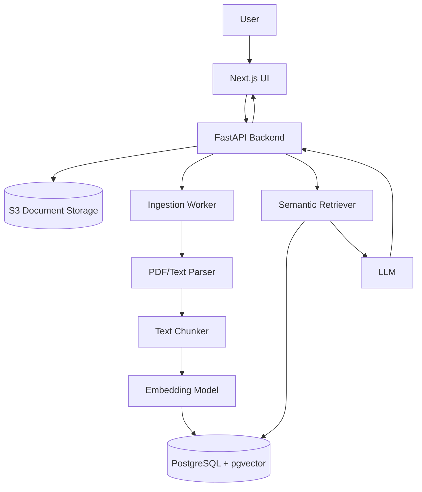

# Architecture

## Overview

AI Workspace Platform is a production-style AI chat application built with Next.js, FastAPI, PostgreSQL, Docker, and OpenAI.

The system supports:

- Streaming LLM responses
- Multi-turn conversation context
- Persistent conversation history
- Markdown, table, and code rendering
- Retry and stop generation
- Dockerized local development
- Cloud-ready deployment architecture

---

## High-Level Architecture

---

## Streaming Chat Architecture

---

## Conversation Persistence Flow

---

## Message Persistence Flow

---

## Docker Compose Architecture

---

## Local Development Services

| Service  | Technology | Port |
| -------- | ---------- | ---- |
| Frontend | Next.js    | 3000 |
| Backend  | FastAPI    | 8000 |
| Database | PostgreSQL | 5432 |

---

## Database Schema

### conversations

| Column     | Type     | Description            |
| ---------- | -------- | ---------------------- |
| id         | string   | Unique conversation ID |
| user_id    | string   | Mock user ID for MVP   |
| title      | string   | Conversation title     |
| created_at | datetime | Creation timestamp     |
| updated_at | datetime | Last updated timestamp |

### messages

| Column          | Type     | Description            |
| --------------- | -------- | ---------------------- |
| id              | string   | Unique message ID      |
| conversation_id | string   | Parent conversation ID |
| role            | string   | `user` or `assistant`  |
| content         | text     | Message content        |
| created_at      | datetime | Creation timestamp     |

---

## Backend Responsibilities

The FastAPI backend is responsible for:

- Request validation
- OpenAI API orchestration
- Streaming response handling
- Conversation persistence
- Message persistence
- Error handling
- Environment-based configuration

The frontend never calls OpenAI directly. This keeps API keys secure and allows the backend to handle authentication, rate limiting, logging, retrieval, and future provider switching.

---

## Frontend Responsibilities

The Next.js frontend is responsible for:

- Chat UI
- Conversation sidebar
- Streaming response rendering
- Markdown/table/code rendering
- Retry last message
- Stop generation using AbortController
- Loading previous conversations
- Managing active conversation state

---

## Cloud Deployment Architecture

Planned AWS deployment:

---

## AWS Components

| Component                   | Purpose                                 |
| --------------------------- | --------------------------------------- |
| ECR                         | Store backend Docker image              |
| ECS Fargate                 | Run FastAPI backend container           |
| RDS PostgreSQL              | Store conversations and messages        |
| S3                          | Future document storage for RAG         |
| CloudWatch                  | Logs and monitoring                     |
| Secrets Manager / SSM       | Store API keys and database credentials |
| IAM                         | Least-privilege service permissions     |
| ALB                         | Route traffic to backend service        |
| VPC/Subnets/Security Groups | Network isolation and access control    |

---

## Future RAG Architecture

---

## MVP Tradeoffs

Current MVP tradeoffs:

- Uses a fixed demo user ID instead of real authentication
- Uses PostgreSQL directly without Alembic migrations
- Uses Docker Compose for local production-like setup
- Uses OpenAI as the only LLM provider
- Stores chat history but does not yet support RAG

These are intentional tradeoffs to prioritize the core AI workflow, streaming architecture, and persistence model.

---

## Production Improvements

Future improvements:

- Add real authentication with JWT or Auth.js
- Add Alembic database migrations
- Add Redis-based rate limiting
- Add request IDs and structured logging
- Add OpenTelemetry tracing
- Deploy backend to AWS ECS Fargate
- Use RDS PostgreSQL instead of local PostgreSQL
- Store secrets in AWS Secrets Manager or SSM
- Add Terraform infrastructure as code
- Add RAG with S3, pgvector, and async ingestion pipeline
