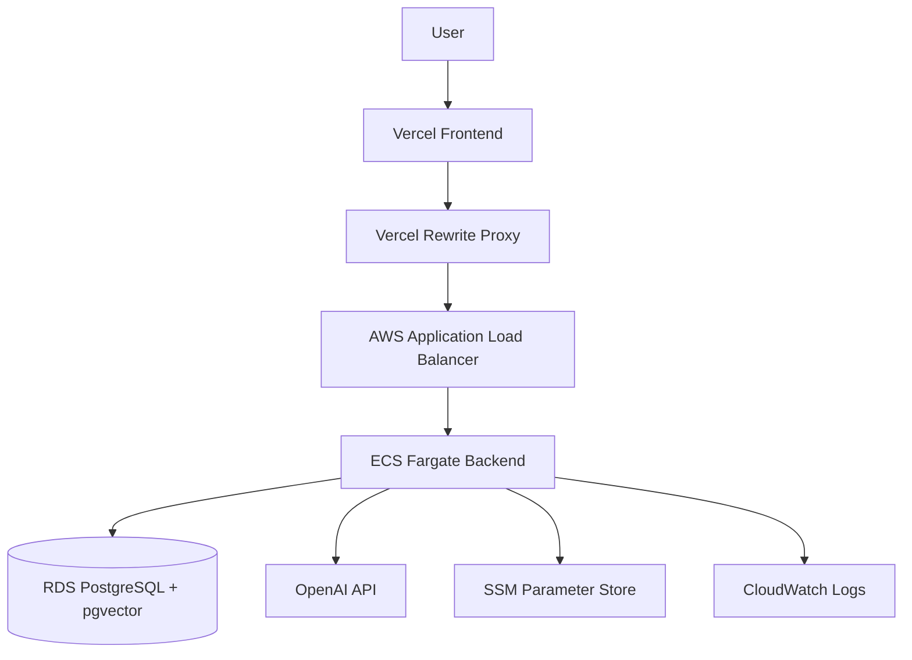
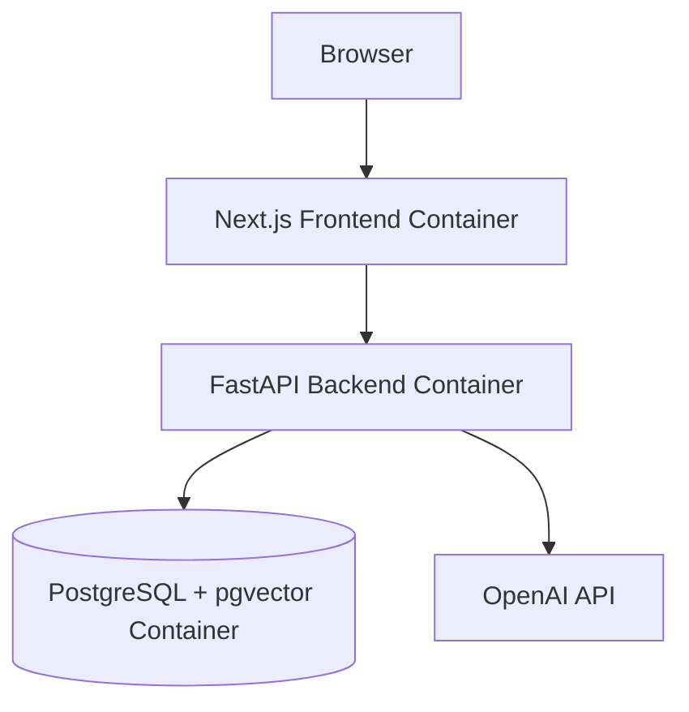
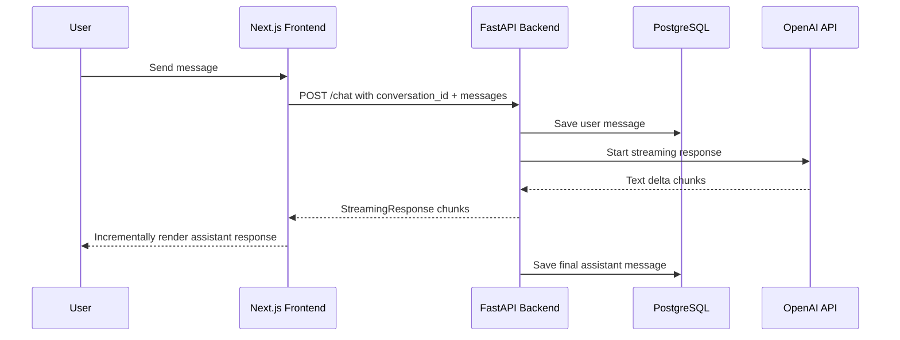
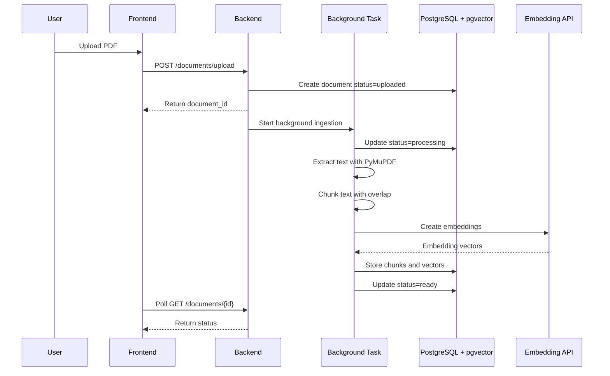
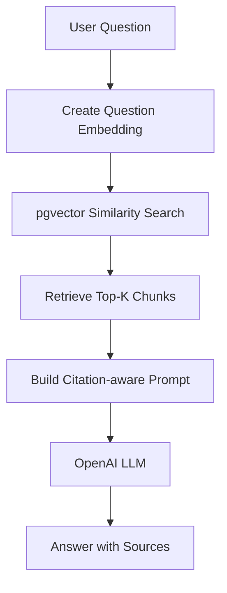
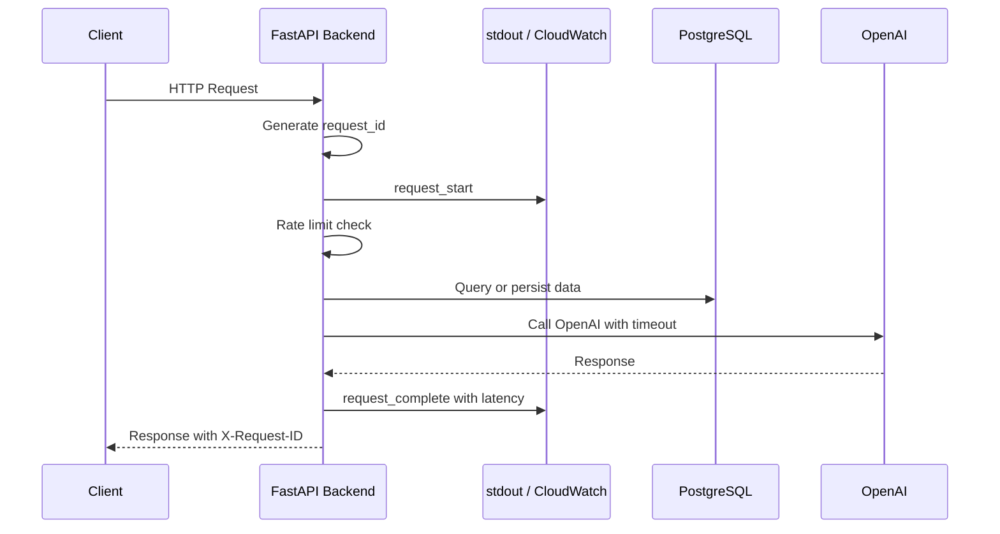

# Architecture

AI Workspace Platform is a production-style AI application with:

- Streaming AI chat
- Persistent conversation history
- RAG document Q&A
- Async PDF ingestion
- Citation-aware answers
- Dockerized local development
- AWS ECS/RDS deployment
- Vercel frontend deployment

---

## High-Level Architecture

```text
User
 ↓
Vercel Frontend
 ↓
Vercel Rewrite Proxy
 ↓
AWS Application Load Balancer
 ↓
ECS Fargate FastAPI Backend
 ↓
RDS PostgreSQL + pgvector
 ↓
OpenAI API

CloudWatch collects logs.
SSM Parameter Store injects secrets.
```

---

## Cloud Architecture



---

## Local Docker Architecture



---

## AI Chat Flow



---

## Conversation Persistence

```text
User opens app
 ↓
Frontend calls GET /conversations
 ↓
Backend loads conversations from PostgreSQL
 ↓
User selects conversation
 ↓
Frontend calls GET /conversations/{id}
 ↓
Backend returns messages
 ↓
Frontend restores chat history
```

---

## RAG Ingestion Flow



---

## RAG Question Answering Flow



---

## Reliability and Observability Flow



---

## Main Components

| Component           | Responsibility                                               |
| ------------------- | ------------------------------------------------------------ |
| Next.js Frontend    | Chat UI, document UI, streaming rendering, status polling    |
| FastAPI Backend     | API orchestration, OpenAI calls, streaming, RAG, persistence |
| PostgreSQL          | Conversations, messages, documents, chunks                   |
| pgvector            | Vector similarity search for RAG                             |
| OpenAI API          | Chat completions and embeddings                              |
| Docker Compose      | Local development environment                                |
| Vercel              | Frontend hosting and rewrite proxy                           |
| ALB                 | Routes external traffic to ECS backend                       |
| ECS Fargate         | Runs backend container                                       |
| ECR                 | Stores backend Docker image                                  |
| RDS PostgreSQL      | Managed production database                                  |
| CloudWatch          | Backend logs                                                 |
| SSM Parameter Store | Secrets injection                                            |

---

## Database Models

### conversations

```text
id
user_id
title
created_at
updated_at
```

### messages

```text
id
conversation_id
role
content
created_at
```

### documents

```text
id
user_id
filename
status
error_message
created_at
updated_at
```

### document_chunks

```text
id
document_id
content
embedding
chunk_index
page_number
created_at
```

---

## MVP Tradeoffs

Current MVP decisions:

- Mock user ID instead of real authentication
- FastAPI BackgroundTasks instead of Celery/SQS
- In-memory rate limiting instead of Redis
- SQLAlchemy `create_all` instead of Alembic migrations
- Vercel rewrite proxy instead of HTTPS custom domain for ALB
- Local Docker Compose before full Terraform automation

---

## Production Improvements

Planned improvements:

- JWT/Auth.js authentication
- Redis-based rate limiting
- SQS or Celery-based ingestion workers
- S3 document storage
- Alembic database migrations
- HTTPS ALB with ACM and Route 53
- Terraform infrastructure as code
- GitHub Actions CI/CD
- OpenTelemetry tracing
